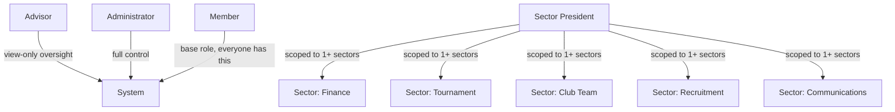
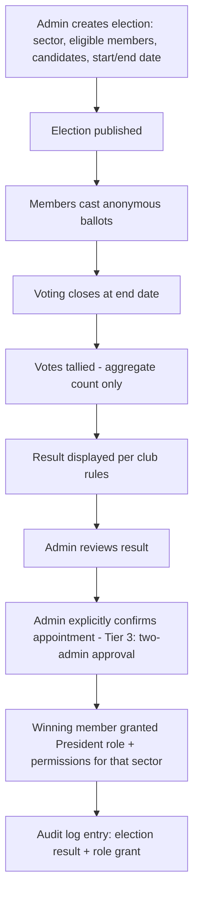
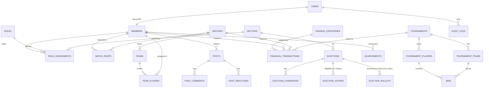

# CLUB 90s — Software Requirements Specification & Technical Design Document

**Version 1.0 | September 2026**
**Document type:** SRS + Technical Design Document
**Audience:** Developers / coding agents implementing the CLUB 90s platform

---

## 1. Executive Summary

CLUB 90s is a private football community, not a professional club. It currently runs on Messenger, a Facebook group, spreadsheets, and manual coordination. This document specifies a **mobile-first Progressive Web App (PWA)** that becomes the club's system of record for membership, weekly match RSVP and team formation, finance (fees, expenses, income), tournaments and player bidding, elections for sector presidents, a lightweight community feed, and administrative governance.

The design deliberately favors a **simple modular monolith**, a **relational schema on MySQL**, and **free/low-cost infrastructure** (Vercel + Aiven) over microservices or exotic real-time infrastructure, because the user base is small (roughly 30–80 members), the club has no dedicated engineering team, and long-term maintainability matters more than theoretical scale.

Two requirement documents from the club were merged into this specification: the original feature set (Sections 1–48 numbering below reorganized) and a follow-up set covering **initial data migration from spreadsheets, account activation, member achievements, a text news feed, and anonymous president elections**. Both are treated as binding requirements; where the club's draft design had gaps or risks (e.g., naive vote storage, plaintext password emails, unencrypted bidding races), this document proposes the safer professional alternative and explains why.

---

## 2. Club Background

CLUB 90s is a member-funded amateur football community. Members pay monthly dues into a club fund; a Finance President manually reconciles bKash payments against members. Senior members (job-holders/business owners) and junior members participate together. Weekly matches are organized on Fridays/Saturdays at rented turfs. The club occasionally runs intra-club tournaments with a player-bidding draft for team selection. Governance is informal today: 2–3 advisors, 2 trusted admins, and sector "presidents" (Finance, Tournament, Club Team, Recruitment, Communications, etc.) who may in the future be elected rather than appointed.

## 3. Problem Statement

Club operations are fragmented across tools not designed for club administration:

| Current tool | Used for | Problem |
|---|---|---|
| Messenger | Match calls, RSVP | No structured RSVP count, easy to lose track, no deadline enforcement |
| Facebook Group | Notices | Not searchable/filterable, no targeting, no read receipts |
| Spreadsheets | Finance, attendance | No access control, error-prone, no audit trail, single point of failure |
| Manual memory | Team formation, tournament bidding | Not repeatable, disputes over "who said what", no historical record |

There is no single place to see "am I paid up," "who's playing Friday," "who's on my team," or "what did the club spend this month."

## 4. Goals

1. Centralize match RSVP, team formation, finance, tournaments, and communication in one mobile-first app.
2. Preserve the club's existing manual-payment-collection process (bKash to Finance President) while digitizing the *recording* of that payment.
3. Support role-based administration that mirrors the club's real organizational structure (advisors, admins, sector presidents, members) without hardcoding the sector list.
4. Provide a safe, auditable path for migrating existing members and their financial history from spreadsheets into the new system.
5. Support anonymous, tamper-resistant voting for president elections, while keeping all other club activity (posts, achievements, match participation) identifiable.
6. Operate on free/low-cost infrastructure suitable for a self-funded club, without locking the club into unsustainable paid tiers.
7. Feel like a friendly community app, not an enterprise dashboard — while treating finance, auth, and admin actions with production-grade rigor.

## 5. Non-Goals (Explicitly Out of Scope for V1)

- **Automated payment collection/bKash API integration.** Payments remain manual/reported; the app only records them. (Revisit only if bKash's merchant API becomes practical for the club's transaction volume — likely not worth the compliance overhead for an amateur club.)
- **Public-facing marketing site.** This is a private, login-only club tool.
- **Real-money betting or gambling mechanics** in tournament bidding — the bidding system is a recreational team-selection mechanic using virtual budget only, never real currency.
- **Cryptographically verifiable e-voting** (e.g., homomorphic tallying, blind signatures). The election feature needs *practical* privacy for a private club of dozens of people, not university/national-election-grade cryptography.
- **Native iOS/Android apps.** The PWA covers "installable, app-like" needs; native apps are a possible Phase 3+ item if the club ever needs deeper OS integration (e.g., background push reliability on iOS, which PWAs still handle imperfectly).
- **Live match scoring / performance stat tracking** (goals, assists, ratings) — deferred to Phase 3, see Section 39.
- **Full social media features** (image/video feed, DMs, stories). The feed is intentionally text-first and lightweight.

## 6. Stakeholders

| Stakeholder | Interest |
|---|---|
| Club Advisors (2–3) | Oversight, no day-to-day system use expected beyond a member view |
| Administrators (2) | Full system control: roles, finance oversight, elections, audit |
| Sector Presidents | Sector-scoped management (finance, tournament, team, recruitment, comms) |
| General Members | RSVP, view info, pay fees, participate in feed/elections/achievements |
| Prospective Members | Recruitment pipeline, eventually become Members |
| Developer(s) | Build and maintain the system from this specification |


---

## 7. User Roles & Permission Model

### 7.1 Role Hierarchy

The system uses **RBAC with sector scoping**: a user has one account, zero-or-more **role assignments**, and each president-type role assignment is scoped to a specific **sector** (a dynamic, admin-managed entity — never a hardcoded enum). This means "Finance President" is really "President role, scoped to the Finance sector," and new sectors (e.g., "Merchandise") can be created without a code change.



Every account has the base **Member** role. Additional roles (President of X, Admin, Advisor) are *additive* — a Finance President is still a Member for the purposes of RSVPing to matches and viewing their own profile. a spreadsheet will be given. acounts will be seeded. link: https://docs.google.com/spreadsheets/d/13lqFl7uPqmi6HGxdNMitPs1uPfVywOwal5Z-NSvbv5w/edit?usp=sharing . also who will newly register, needs to give this information from the spreadsheets.


### 7.2 Permission Matrix (Representative — Not Exhaustive)

| Capability | Member | Sector President (own sector) | Admin | Advisor |
|---|:---:|:---:|:---:|:---:|
| View matches, RSVP | ✅ | ✅ | ✅ | ✅ (view only) |
| Create/edit matches | ❌ | ✅ (Tournament/Club Team/relevant sector) | ✅ | ❌ |
| Form teams for a match | ❌ | ✅ (Club Team) | ✅ | ❌ |
| Record a payment | ❌ | ✅ (Finance only) | ✅ | ❌ |
| View own payment history | ✅ | ✅ | ✅ | ❌ |
| View another member's payment history | ❌ | ✅ (Finance only) | ✅ | ❌ |
| Void a financial transaction | ❌ | ✅ (Finance only) | ✅ | ❌ |
| Create a tournament | ❌ | ✅ (Tournament only) | ✅ | ❌ |
| Enable/manage bidding | ❌ | ✅ (Tournament only) | ✅ | ❌ |
| Post to news feed | ✅ | ✅ | ✅ | ✅ |
| Moderate/delete others' posts | ❌ | ❌ | ✅ | ❌ |
| Add own achievement | ✅ | ✅ | ✅ | ✅ |
| Create an election | ❌ | ❌ | ✅ | ❌ |
| Cast a vote (if eligible) | ✅ | ✅ | ✅ | ✅ |
| View individual ballots | ❌ | ❌ | ❌ (see §16) | ❌ |
| Assign/confirm a president role | ❌ | ❌ | ✅ | ❌ |
| Create/manage sectors | ❌ | ❌ | ✅ | ❌ |
| Import members/finance from spreadsheet | ❌ | ❌ | ✅ | ❌ |
| View audit logs | ❌ | ❌ | ✅ | ❌ |
| Change club settings (fees, deadlines) | ❌ | ❌ | ✅ | ❌ |

**Design note on Advisors:** the brief lists Advisors but gives them no explicit action items. Recommendation: Advisors get a **read-only oversight view** (club-wide dashboard, finance summary, member list) but no write permissions. This matches their real-world role (senior guidance, not day-to-day admin) and avoids a fourth full permission track to maintain. If the club later wants advisors to co-approve specific actions, model it as an explicit "Advisor Reviewed" flag on the relevant workflow rather than a general role expansion.

### 7.3 Permission Enforcement Principle

**All authorization is enforced server-side**, on every API call, based on the authenticated user's role assignments loaded fresh from the database (or a short-TTL cache invalidated on role change) — never trusted from the client. The frontend hides UI it has no permission for, purely for UX; that hiding has zero security value on its own.

### 7.4 Confirmation-Tier Model for Sensitive Actions

Not every admin action deserves the same friction. A blanket "two-admin approval for everything" policy will get bypassed by real users under time pressure (e.g., needing to swap a president before Friday's match). Recommended three tiers:

| Tier | Examples | Mechanism |
|---|---|---|
| **Tier 1 — Simple confirmation** | Editing a match, publishing an announcement, editing own profile | A single "Are you sure?" modal. No re-auth. |
| **Tier 2 — Admin re-authentication** | Assigning/removing a president, deactivating a member, editing a financial transaction, voiding a transaction, changing club-wide settings (fee amounts, deadlines) | Modal shows before/after diff (old role → new role, permissions gained) **and** requires re-entering password or a short-lived step-up token. Action is logged to the audit trail with the diff. |
| **Tier 3 — Two-admin approval** | Confirming an election result and granting a president role, deleting a member account outright, bulk financial import, changing an admin's own role, disabling the other admin's account | Action is created in a "Pending Approval" state by Admin A; Admin B must independently review and approve before it takes effect. Prevents a single compromised or careless admin from unilaterally taking club-critical actions. |

Rationale: Tier 3 is reserved for actions that are (a) hard to reverse, (b) concentrate power, or (c) touch the trust boundary between "the community voted" and "the system grants access" (the election → role-grant flow explicitly required in the club's second requirements doc). Requiring two-admin approval for routine things like editing a match date would create friction with no security benefit and train admins to route around the safeguard — so it is intentionally scoped narrowly.


---

## 8. Match Management & RSVP

### 8.1 Match Entity

Fields: title, sport date/day/start/end time, venue name + address + optional map link, match fee, max players, RSVP deadline, organizer (a user), notes, status (`draft`, `published`, `cancelled`, `completed`).

### 8.2 RSVP Design: IN / OUT / MAYBE

**Recommendation: implement MAYBE, but treat it as a "soft" state that does not count toward confirmed slots.** Reasoning: for an amateur club with working professionals, a binary IN/OUT forces premature commitment and produces noisy last-minute flips. MAYBE gives a true picture ("I'll try to make it") without polluting the confirmed headcount. The organizer view should clearly separate **Confirmed (IN)**, **Maybe**, **Out**, and **No response**, with Confirmed being the number that matters for slot-filling and finance.

Members can change their RSVP any number of times before the deadline; the app records only the current state (see §31 for how "changed IN→OUT" is handled operationally) but keeps a lightweight change history for audit/organizer trust ("this member flipped 3 times").

### 8.3 RSVP Summary View (Organizer)

- Total IN / OUT / MAYBE / No response
- Confirmed players list (tap to remove/promote from waitlist)
- Remaining slots (max_players − confirmed IN)
- Waitlist: once max_players is reached, further IN votes go to a waitlist queue in vote-order; if a confirmed player switches to OUT, the first waitlisted player is auto-promoted and notified.
- "Who hasn't responded" list, to enable a manual nudge (Phase 1: organizer messages them manually via Messenger; Phase 2: in-app nudge notification).

### 8.4 Admin Override

Admins/organizers can override the RSVP deadline (e.g., reopen it) — this is a Tier 1 action but is logged, since silently reopening RSVP after a "final" list was already used for team formation could cause confusion.

---

## 9. Team Formation

### 9.1 MVP Scope

- Organizer selects from the **Confirmed (IN)** list for a match.
- **Manual assignment**: drag players into Team A / Team B / Team C boxes (or tap-to-assign on mobile, since drag-and-drop is fiddly on small touchscreens — recommend tap-to-assign as the primary mobile interaction, with drag-and-drop as a progressive enhancement on larger screens).
- **Random team generation**: one-tap shuffle of confirmed players into N even teams, with the organizer able to manually adjust afterward.
- Goalkeeper designation (single flag per team).
- Draft/Publish states: a draft is visible only to the organizer; publishing makes it visible to all RSVP'd members and triggers a notification.
- Edit before match start; once match status becomes `completed`, teams lock automatically (still viewable, not editable) to preserve historical accuracy.

### 9.2 Explicitly Phase 2+

- Position-based balancing algorithms ("balance by preferred position").
- Skill-based/ELO-style auto-balancing — there is no reliable skill data yet; building this before player-rating data exists would just be guessing.
- Full drag-and-drop pitch-diagram formation editor (visual 4-3-3 style board). Nice-to-have, not required for the club to function.

---

## 10. Finance Module

### 10.1 Core Model: Single Ledger, Not Separate Spreadalike Tables

A common mistake in club apps is creating separate tables for "monthly fees," "match fees," and "expenses" that don't share a schema. Instead, use **one `financial_transactions` ledger** with a `type` (`income`/`expense`), a `category` (foreign key to a configurable `finance_categories` table — Monthly Fee, Match Fee, Tournament Fee, Sponsorship, Merchandise, Turf Cost, Referee, Jerseys, etc.), and optional links to `member_id`, `match_id`, `tournament_id`. This gives you:

- One place to query "club balance" (sum of income − sum of expenses).
- Reports (monthly, match, tournament, member) are just filtered views/aggregations of the same ledger — no duplication, no drift between "the finance report" and "the match report."
- New categories (e.g., "Water Bottle Sales") are a data row in `finance_categories`, not a schema migration.

### 10.2 Monthly Membership Fee Workflow

Finance President searches a member (search-first UX, not a long dropdown), selects "Monthly Fee," picks the month, enters/confirms the amount (defaulted from `club_settings.monthly_fee`, overridable for partial payments), and saves. The system derives status per member per month:

- **Paid**: amount recorded ≥ configured fee for that month.
- **Partial**: amount recorded > 0 but < configured fee.
- **Unpaid**: no transaction recorded for that member/month.
- **Overpaid**: amount recorded > configured fee (common when someone pays ahead).

This status is *derived*, not stored — it's computed from the ledger at query time (or cached/materialized for dashboard performance), so changing the monthly fee going forward never corrupts historical status.

### 10.3 Match & Tournament Fees

Same ledger, `category = Match Fee` linked to `match_id`, or `category = Tournament Fee` linked to `tournament_id`. A match's financial summary = sum of its linked income (fees collected) minus sum of its linked expenses (turf cost, refreshments) recorded against that `match_id`.

### 10.4 Financial Dashboard

Balance, total income/expense (all-time and current month), outstanding member fees (members with Unpaid/Partial status for the current month), match revenue, tournament net, sponsorship/merchandise income, recent transactions list. Filters: date range, category, income/expense, member, match, tournament. Charts: keep to 2–3 on mobile (balance trend line, income-vs-expense bar by month) — a wall of charts on a phone is a UX failure, not a feature.

### 10.5 Audit & the VOID/REVERSED Pattern

**Financial transactions are never hard-deleted.** Instead, an incorrect transaction is marked `status = voided` with a required reason, `voided_by`, and `voided_at`; a corrected transaction is created as a new row (optionally linked via `reversal_of_transaction_id`). 

Why: (1) accounting integrity — deletion destroys the evidence that something was recorded and why it was wrong, which is exactly what you need if a member later disputes "I definitely paid in March"; (2) audit trail — a voided-and-recreated transaction shows the full story (original entry → who voided it → why → the correction), whereas a hard delete just makes history vanish; (3) it mirrors how real accounting systems (and every payment processor) handle corrections — reversing entries, not deleting ledger rows.


---

## 11. Tournament Management & Player Bidding

### 11.1 Tournament Entity

Name, dates, registration deadline, number of teams, format (5v5/7v7/etc.), rules text, venue, fee, prize info, status (`draft`, `open`, `in_progress`, `completed`, `cancelled`), and a `bidding_enabled` flag set at creation.

### 11.2 Bidding Architecture — Recommended: Turn-Based / Simple Polling, Not WebSockets

The brief asks us to choose between real-time WebSocket, polling, SSE, or turn-based bidding. For a club of a few dozen people bidding on maybe 20–30 players in one sitting, **a structured turn-based auction with short-interval polling (e.g., every 2–3 seconds) or Server-Sent Events for live updates is sufficient and dramatically simpler to build and host reliably on serverless (Vercel) than raw WebSockets**, which need a persistent connection that doesn't map cleanly onto Vercel's serverless functions (you'd need a separate always-on service, e.g., a small WebSocket relay, adding real infrastructure and cost for a feature used a few times a year).

Recommended mechanics:
1. Admin/Tournament President builds the **player pool** and sets **team owners/captains**, **starting budget per team**, **min/max squad size**, and a **starting bid** per player (or a pool-wide default).
2. Players are auctioned **one at a time, server-controlled order** (sequential, not simultaneous free-for-all across all players at once — this eliminates most race conditions by construction).
3. Each bid is a request: `POST /tournaments/:id/bids { playerId, teamId, amount }`. The **server** is the single source of truth for "current highest bid" — it rejects any bid that (a) doesn't exceed the current highest bid by at least the configured increment, (b) would exceed the bidding team's remaining budget, or (c) arrives after the bid window/timer for that player has closed. This makes near-simultaneous bids a non-issue: the database transaction serializes them, and whichever valid bid the server accepts first wins — the "conflict" is resolved by normal transactional locking (`SELECT ... FOR UPDATE` on the player's current-bid row), not by client-side timing.
4. A short per-player countdown timer (e.g., 15–30 seconds, resets a few seconds on a new valid bid — a classic "soft close" auction pattern) gives a natural, unambiguous end. Timer expiry is authoritative and evaluated server-side (via a scheduled check or on next relevant request), not trusted from the client's clock.
5. On close: highest bidder wins, player is marked `sold` to that team at that price, both team budget and squad size update, and the pool advances to the next player. If no bids: `unsold`, optionally re-queued at end.
6. Clients poll `GET /tournaments/:id/bidding/state` every 2–3s (or subscribe via SSE) for live current-player/current-bid/time-remaining — cheap, reliable, and trivially recoverable if a client refreshes mid-auction (edge case in §37).

This satisfies "simplest reliable architecture for a small private club" while giving a genuinely live-feeling auction experience.

### 11.3 Safeguards Against Accidental/Conflicting Bids

- Server-side minimum-increment and budget-sufficiency validation (never trust client-computed "can I afford this").
- Idempotency: each bid submission carries a client-generated request ID; duplicate submissions (e.g., double-tap) within the window are deduplicated.
- Optimistic-locking / row versioning on the "current bid" record so two near-simultaneous requests can't both "win" a race — the DB transaction guarantees only one succeeds, the other gets a clean "someone just outbid you" response.
- A team owner cannot bid on behalf of a team they don't own (server checks `team_owner_id == current_user_id` or admin override).

### 11.4 Tournament Finance

Tournament expenses/income post to the same ledger (§10.1) with `tournament_id` set, categories like Turf, Referee, Jerseys, Trophies, Prize Money, Sponsorship, Registration Income. Tournament summary = income − expense for that `tournament_id`, shown alongside the tournament detail page.

---

## 12. Member Management & Recruitment

### 12.1 Member Statuses

`active`, `inactive`, `pending` (mid-recruitment, no login yet or account exists but not confirmed).

### 12.2 Profile Fields

**Identity:** name, profile picture, DOB, joining date.
**Football:** position, jersey number, preferred foot (optional), achievements (§13).
**Club:** current sector/role, president role if applicable.
**Personal (restricted):** phone, email — visible only to the member themself and to Admin/Finance where operationally necessary (e.g., Finance needs phone/email to chase a payment; a normal member does not need another member's phone number to RSVP to a match).
**Emergency contact:** optional, restricted to Admin-only visibility, collected only if the club decides it's worth the privacy trade-off — recommend making this an opt-in field, not required, since it's sensitive and not core to the app's function.

### 12.3 Recruitment Workflow

`Prospective member added → basic info recorded → recruitment review (Recruitment President) → approval (Recruitment President or Admin, configurable) → account created / invitation sent → member becomes active → joining fee recorded if applicable`. This reuses the same account-activation mechanism as bulk import (§14) — a prospective member added one-at-a-time is functionally a single-row import.

---

## 13. Member Achievements

Fields: title, description, date/year, tournament/event name (free text or link to a tournament if it's a CLUB 90s tournament), issuing organization, optional image/certificate, visibility (default: visible to all members — see privacy note below).

**Recommendation: support image/certificate upload in MVP, but keep it simple** — a single optional image per achievement stored in cheap object storage (see §28), not a full gallery/document management system. Achievements are a pride/showcase feature; a photo of a trophy or a certificate scan is exactly the kind of content members will actually want to add, and object storage for a few dozen small images costs effectively nothing. What to defer to Phase 2: achievement "endorsements/likes," verification/approval workflow, and achievement categories/leaderboards — the brief explicitly warns against overcomplicating this into a ranking system, and that's the right call.

Achievements are **identifiable** (author always shown) per the "nothing anonymous except elections" rule (§16).

---

## 14. Birthday System

**Recommendation: show day/month only, never birth year, to all members.** Age/birth year is more sensitive than most people realize (it correlates with things like insurance/employment discrimination risk in some contexts, and simply isn't needed for "wish someone happy birthday"). Store full DOB in the database (useful internally, e.g., for a future "18+ only tournament" rule, and for the member's own profile view), but the **birthday widget/list exposed to other members only ever renders day+month**. This is a privacy-by-default design: one column, two visibility levels, enforced at the API/serialization layer, not by hoping the frontend hides it.

Dashboard shows "Today's Birthdays" and a short upcoming list (next 14–30 days), sorted by date.


---

## 15. Community News Feed

Lightweight, text-first internal feed. Every member (and president/admin) can create a text post; edit/delete own posts; basic emoji-style reactions and simple threaded comments are supported but kept minimal (no rich text editor, no image-first posting requirement — an optional single image attachment is acceptable if trivial to add via the same object storage used for achievements, but it is not core).

**Moderation:** Admins can hide/remove a post or comment and must record a reason; every moderation action is written to the audit log with the moderator's identity (never silent, never anonymous on the admin's side — see §16.4). Reported-content review is a simple "Report" button on a post → appears in an Admin moderation queue; no automated content filtering is required for MVP given the trusted, small membership.

**Permissions:** all members can post; presidents can additionally post "sector updates" (visually tagged, e.g., a small "Finance" badge on the post) which is really just a `post.sector_tag` field rather than a separate feature — reuse the same `posts` table.

---

## 16. Elections: Anonymous President Voting

This is the single trickiest privacy requirement in the system: **all other activity in CLUB 90s is identifiable by design, but voting must be anonymous, while still preventing double-voting and preserving enough auditability to trust the result.** Below is the recommended design and why a naive `voter_id → candidate_id` table is wrong.

### 16.1 Why the Naive Design Fails

A single table `votes(voter_id, candidate_id)` technically prevents double voting (unique constraint on `voter_id, election_id`) but it **permanently links every member to their exact vote in the database**. Any admin with query access — or any future data breach — reveals every ballot. That violates "candidates cannot see who voted for whom" and "normal administrators should not casually be able to browse individual ballots" as stated requirements, not just a nice-to-have.

### 16.2 Recommended Design: Separate Eligibility from Ballot

Split the election into **two tables with no shared key that ties a person to their choice**:

1. **`election_voters`** — tracks *that* a specific eligible member has voted (for one-vote enforcement), but stores **no candidate information**. Columns: `election_id`, `member_id`, `voted_at`. A unique constraint on `(election_id, member_id)` guarantees one vote per member — enforced at the point the member *casts* their vote, in the same database transaction as step 2, so the two writes are atomic and can't be replayed separately.

2. **`election_ballots`** — stores the actual choice, but with **no `member_id` column at all**. Columns: `election_id`, `candidate_id`, `cast_at`, and a random opaque `ballot_token` (server-generated UUID, not derived from the member's identity in any reversible way — e.g., not `hash(member_id)`, which *could* be reversed by brute-forcing the small member list). Because there is no member reference in this table, **no query against `election_ballots` alone can ever reveal who voted for whom** — not even to a database administrator with full read access, short of correlating row-insert *timing* with `election_voters` (see §16.3 for the mitigation).

The API endpoint that casts a vote performs both writes in a single transaction: insert into `election_voters` (fails if already present → "you have already voted"), then insert into `election_ballots`. The **application layer**, not the client, is the only thing that ever sees the member-to-choice link, and it is not persisted anywhere — it exists only transiently in the request's memory during that one API call. This is the standard "split ballot box" pattern used in most practical (non-cryptographic) internal-election systems, and it is proportionate: it stops casual snooping and single-admin misuse without requiring the club to build actual cryptographic voting.

### 16.3 Timing-Correlation Mitigation

To prevent an admin from correlating `election_voters.voted_at` timestamps with `election_ballots.cast_at` timestamps to guess who voted for whom (a real weakness if votes trickle in one at a time), the ballot write should be **queued and inserted in a randomized micro-batch** (e.g., buffer ballots server-side for a short window, or at minimum strip precise timestamps from the ballot table down to date-only granularity, and insert ballots in shuffled order rather than arrival order at close-of-election). For a club-scale election (dozens of voters over a multi-day voting window), even the simplest mitigation — storing only a coarse `cast_at` date on the ballot, with no time component — is enough to defeat casual correlation, and is the pragmatic choice here.

### 16.4 What Admins *Can* See

- The list of who has/hasn't voted (`election_voters`) — needed to know when to close voting or chase turnout — **without** any link to their choice.
- The final tally per candidate (`SELECT candidate_id, COUNT(*) FROM election_ballots WHERE election_id = ? GROUP BY candidate_id`) once voting closes.
- They **cannot** see any individual ballot; there is no query path from a member to their vote in the schema. This should be treated as a hard architectural invariant and covered by a dedicated automated test (§40).

### 16.5 Election Workflow & Role-Grant Separation



**Critical rule, stated explicitly per the requirements: winning an election does not auto-grant permissions.** The election produces a *result*; a separate, admin-executed, two-admin-approved (Tier 3, §7.4) action grants the role. This deliberately separates "the community chose someone" from "the system trusts someone with Finance API access," which protects against a compromised or joke/mistaken election outcome from instantly becoming a security incident.

### 16.6 President Role Lifecycle

States: `nominated → candidate → elected (pending admin confirmation) → active president → suspended | removed | term ended`. Removal/term-end is an admin action (Tier 2) that revokes the sector-scoped role assignment; the member reverts to plain Member. If a president leaves the club (`inactive`), their role assignment is automatically suspended (not silently kept active) and flagged for admin review. Re-running a cancelled/disputed election simply creates a new `elections` row referencing the same sector — history of the prior (voided) election is retained for audit, not deleted.


---

## 17. Initial Data Migration (Members & Finance)

### 17.1 Member Import Pipeline

`Spreadsheet (CSV/XLSX) → validate → detect duplicates/missing fields → normalize → create member + auth records → mark active → generate import report`.

**Member import template:**

| Column | Required | Notes |
|---|:---:|---|
| `full_name` | Yes | |
| `email` | Yes | Must be unique; used for account activation |
| `phone` | No | |
| `date_of_birth` | No | ISO `YYYY-MM-DD` |
| `joining_date` | Yes | Defaults to import date if blank |
| `position` | No | Free text, normalized against a small controlled list where possible |
| `jersey_number` | No | |
| `status` | No | Defaults to `active`; allowed values `active`/`inactive`/`pending` |

Validation rules: reject rows with missing `full_name` or `email`; flag (don't silently drop) duplicate emails within the file and against existing members; normalize phone format and trim whitespace; flag invalid dates rather than guessing. Output report: **Imported / Skipped / Failed / Duplicate / Invalid**, each with the row number and reason, downloadable as CSV so the admin can fix the source spreadsheet and re-run just the failed rows (the import should be safely re-runnable / idempotent on email as the natural key).

### 17.2 Account Activation (Not Plaintext Passwords)

**Recommendation: single-use, expiring activation links (a specific case of password-reset link), not one-time codes or magic links.** Reasoning:
- **Never email plaintext passwords** — a permanent secret sitting in an inbox forever is a standing security liability, and email is not a secure channel.
- **One-time numeric codes** (like SMS OTP) are fine for *repeated* login (magic links each time) but add friction for a *one-time* setup step and require the user to context-switch between email and the app to type a code — a plain "tap this link" is simpler for a non-technical, phone-first membership.
- **Recurring magic-link login** (a new link every time you log in, no password at all) is attractive for simplicity but is worse for a club app members will open frequently — it means depending on email deliverability for every login, and email is often slower/less reliable than a stored session on a phone. Recommend **password + session-based login for ongoing use**, with the **magic-link pattern used only for the one-time activation/reset step**.

Flow: import creates the member row + a linked `auth_accounts` row in an `unactivated` state → generate a cryptographically random token, store only its **hash** (never the raw token) in `activation_tokens` with an expiry (e.g., 72 hours) → email contains the raw token embedded in a link → member clicks → server hashes the presented token and compares → on match and non-expiry, token is marked used (single-use, can't be replayed) and the member sets their own password (hashed with bcrypt/argon2, never stored/logged in plaintext) → account becomes `active`.

Admins can trigger **"Resend activation email"** for an individual member, which invalidates any prior unused token and issues a new one — raw tokens are never shown in the admin UI or written to logs, only "activation email sent at [timestamp]" is visible.

### 17.3 Bulk Onboarding Email Considerations

- Use a transactional email provider with a workable free tier for club-scale volume (see §28) rather than a generic SMTP box, for deliverability and to avoid the club's domain getting flagged as spam.
- Batch sends with basic rate limiting/backoff to respect provider limits.
- Track delivery status per member (`sent`, `delivered`, `bounced`, `failed`) so admins can see who still needs a manual nudge (e.g., a bounced/invalid email needs the admin to correct the address and resend, not just get retried forever).

### 17.4 Historical Finance Migration

**Recommendation: import historical fee status as real transactions in the same ledger (§10.1), not as a separate "opening balance" blob or free-text notes column.** This keeps every report (member payment history, monthly dashboard, club balance) working uniformly across historical and new data with zero special-casing. Each imported transaction is tagged `source = migrated` with `import_batch_id` and `imported_at`, and `recorded_by` is set to the **admin who ran the import**, not fabricated as "the Finance President recorded this" — the requirement explicitly forbids falsely attributing historical payments to a current officer's manual action. The original spreadsheet cell value (e.g., "Partial" with no amount) should be preserved in a `notes`/`original_value` field if it can't be cleanly mapped to a numeric amount, so nothing is silently guessed.

**Finance migration template:**

| Column | Required | Notes |
|---|:---:|---|
| `member_email` | Yes | Must match an already-imported member |
| `fee_month` | Yes | e.g., `2026-03` |
| `amount_due` | No | Defaults to `club_settings.monthly_fee` at time of import if blank |
| `amount_paid` | Yes | `0` if unpaid |
| `payment_status` | No | Derived if blank; explicit value overrides for edge cases like "waived" |
| `payment_date` | No | If known; otherwise import date is used with a `date_estimated = true` flag |
| `payment_method` | No | `bKash`/`Cash`/`Other`/`Unknown` |
| `notes` | No | Free text carried over from the original sheet |

Corrections to imported records follow the same VOID/REVERSED pattern (§10.5) — an admin never edits a migrated row in place; they void it with a reason and create a corrected replacement, preserving the full history of "what the spreadsheet said" vs. "what we later learned was correct."

### 17.5 End-to-End Migration Plan

1. Prepare standardized member spreadsheet (template above) and validate offline.
2. Dry-run import (validate-only mode) → review the report → fix source data → re-run.
3. Commit member import → accounts created in `unactivated` state.
4. Generate + send activation emails (batched).
5. Import historical finance data (dry-run → review → commit), tagged as migrated.
6. Spot-check: admin verifies a sample of members' derived Paid/Unpaid status against the original spreadsheet.
7. Members activate accounts over a rollout window (e.g., 1–2 weeks); admin monitors an "activation status" list and resends to stragglers.
8. Soft-launch to activated members while club continues Messenger/Facebook in parallel.
9. Full cutover once a critical mass (e.g., >80%) of active members have logged in at least once.
10. **Rollback strategy:** because import is idempotent-by-email and every migrated record is tagged with its `import_batch_id`, a bad import can be **entirely voided by batch** (mark every transaction in that batch as `voided`, reason "import correction") and re-run cleanly, without needing to hand-pick bad rows or touch unrelated data.


---

## 18. Announcements & Notifications

### 18.1 Announcements

Types: General, Match, Tournament, Finance, Urgent, Event. Fields: title, description, author, date, optional attachment/image, priority, expiry date, target audience (all members / a specific sector / active members only). Distinct from the Feed (§15): announcements are **official, single-author, admin/president-controlled broadcasts**; the Feed is **casual, member-driven conversation**. Keeping them as separate models (not "just a pinned post") makes it easy to apply stricter permissions and a distinct, more prominent UI treatment to announcements.

### 18.2 Notification Channels

| Trigger | In-app | Push | Email |
|---|:---:|:---:|:---:|
| New match created / published | ✅ | Phase 2 | ❌ |
| RSVP deadline approaching | ✅ | Phase 2 | ❌ |
| Match venue changed | ✅ | Phase 2 | ❌ |
| Team formation published | ✅ | Phase 2 | ❌ |
| Tournament announced / bidding starting | ✅ | Phase 2 | ❌ |
| Payment recorded (receipt) | ✅ | ❌ | Phase 2 |
| Monthly fee reminder | ✅ | Phase 2 | Phase 2 |
| Urgent announcement | ✅ | Phase 2 | ❌ |
| Birthday | ✅ | ❌ | ❌ |
| Election open / closing soon | ✅ | Phase 2 | ❌ |
| Admin action pending approval (Tier 3) | ✅ | ❌ | Phase 2 |

**MVP = in-app only** (a notifications list/bell in the app, populated on each relevant server event, read/unread state). Web Push requires service-worker plumbing and, on iOS Safari specifically, has historically been unreliable/limited compared to Android — recommend it as a Phase 2 enhancement once the core app is proven, not a launch blocker. Messenger/WhatsApp integration is explicitly out of scope for automated sending (no bot infrastructure) — the club can continue to *manually* cross-post important announcements there if desired.

---

## 19. Dashboards (Role-Specific)

| Dashboard | Key widgets |
|---|---|
| **Member** | Next match + RSVP status, payment status (this month), upcoming tournaments, upcoming birthdays, recent announcements, recent feed activity |
| **President** | Sector-relevant tasks (e.g., Finance President sees outstanding fees; Tournament President sees active bidding), upcoming matches/tournaments in their sector, relevant stats |
| **Finance** | Balance, monthly income/expense, outstanding fees, recent transactions, match/tournament finance snapshot |
| **Admin** | Club overview (active/pending members), upcoming matches, financial summary, active tournaments/elections, **pending Tier-2/Tier-3 approvals**, recent audit log activity |

---

## 20. Mobile-First UX & Navigation

### 20.1 Navigation Structure

**Bottom navigation (mobile), 4–5 items max, role-adaptive:**

- Home (dashboard)
- Matches
- Finance *(only shown if the user has any Finance-related permission or wants to view own payment history — for a plain Member this tab shows "My Payments," not the full Finance module)*
- Community *(Feed + Announcements + Birthdays combined under one tab with sub-navigation, to avoid over-filling the bottom bar)*
- More *(Profile, Tournaments, Elections, Settings, and — only for Presidents/Admins — the Admin console)*

Admin/president-only screens live behind the "More" entry or a role-conditional extra tab, **never** cluttering the primary navigation for a normal member. This directly satisfies "do not overwhelm normal members with administrative features."

### 20.2 Mobile UX Principles Applied

- Large tap targets for IN/OUT/MAYBE (full-width or large pill buttons, not tiny icons).
- Search-first finance entry: Finance President's primary action is a search box, not a scrollable member list.
- Cards, not desktop tables, for matches/transactions/members on mobile; the same data can render as a table on tablet/desktop via responsive breakpoints (Tailwind's `md:`/`lg:` variants) — one component, two layouts.
- Sticky primary action (e.g., "RSVP" button, "Save Payment" button) pinned above the mobile keyboard/safe area.
- Minimal typing: pickers/steppers/toggles over free-text wherever the value is enumerable (month picker, payment method toggle, amount stepper with quick-amount buttons like +50/+100).
- Skeleton loading states, not blank screens, especially on slower mobile connections.
- Dark/light theme: support both via Tailwind's `dark:` classes and `prefers-color-scheme`, with a manual override in settings — low cost to implement, meaningfully appreciated by users who browse at night.
- Football-themed, unobtrusive loading screens (e.g., a subtle spinning ball or pitch-line animation on first load / route transitions) — tasteful, not gimmicky; keep actual in-content loading states (skeletons) fast and boring so they don't get in the way of frequent use.
- Standard, native-feeling scroll and transition behavior: momentum scrolling, `overscroll-behavior: contain` on modals/sheets so background content doesn't scroll-bleed, subtle page/route transitions (150–250ms fade/slide, respecting `prefers-reduced-motion`), and pull-to-refresh on primary list views (Matches, Feed, Transactions) implemented as a small custom hook rather than a heavy animation library, to keep bundle size and performance in check on mobile data.


---

## 21. PWA Requirements

| Element | Requirement |
|---|---|
| Web App Manifest | `name`, `short_name` ("CLUB90s"), `theme_color`, `background_color`, `display: standalone`, `start_url`, icon set (192px, 512px, maskable variant) |
| Icons/Splash | App icon + auto-generated splash screens per platform conventions (Next.js PWA tooling / manual `<meta>` splash images for iOS) |
| Service Worker | Precache the app shell (JS/CSS bundles, core icons); runtime cache for GET API responses using a stale-while-revalidate strategy for read-heavy, low-volatility data (e.g., club settings, sector list) |
| Install Prompt | Custom "Add to Home Screen" prompt shown after a meaningful first interaction (e.g., after viewing 2nd page), not on first load — deferring the native `beforeinstallprompt` event is standard best practice and avoids an annoying immediate popup |
| Push | Deferred to Phase 2 (see §18.2) — requires VAPID key setup + subscription storage per device |

### What Works Offline vs. Requires Internet

| Works offline (cached) | Requires internet |
|---|---|
| App shell loads (no white screen) | RSVP submission |
| Previously viewed match/tournament/profile data (read-only, may be stale) | Recording/viewing live payment data |
| Basic navigation between cached routes | Bidding (live auction state) |
| — | Feed posting/reading fresh content |
| — | Elections/voting |
| — | Login (first session) |

**Explicit non-claim:** this is not an "offline-first" app with local write queuing/sync — that adds significant complexity (conflict resolution, especially dangerous for finance and voting data) for a use case (club members almost always have mobile data at a football pitch or at home) that doesn't justify it. The PWA layer exists for **installability and fast repeat-load performance**, not offline data entry.

---

## 22. Database Architecture

### 22.1 Design Principles

- MySQL, 3NF-normalized core, with a small number of deliberate denormalizations only where read performance clearly benefits (e.g., a materialized "current RSVP counts" — computed on read for MVP scale, revisit only if it becomes slow).
- Sectors are **data, not an enum** — `sectors` is a plain table admins can insert into.
- One `financial_transactions` ledger, not per-category tables (§10.1).
- Election ballots and voter-eligibility are **separate tables with no shared foreign key** (§16.2) — this is the one deliberate anti-normalization-for-privacy exception in the schema, and it's intentional.
- Soft-delete/void patterns for anything with audit significance (finance, roles, posts); hard-delete acceptable only for genuinely disposable data (e.g., an expired unused activation token).

### 22.2 Core Tables

| Table | Purpose | Key columns |
|---|---|---|
| `users` | Login identity | id (uuid, PK), email (unique), password_hash, status (`unactivated/active/suspended`), created_at |
| `members` | Club-member profile, 1:1 with `users` | id (PK), user_id (FK→users, unique), full_name, profile_photo_url, dob, joining_date, position, jersey_number, preferred_foot, status (`active/inactive/pending`), phone (nullable), emergency_contact (nullable) |
| `sectors` | Dynamic sector list | id (PK), name (unique), description, created_by (FK→users), is_active |
| `roles` | Role catalog | id (PK), name (`member/president/admin/advisor`), description |
| `role_assignments` | Who holds what role, optionally scoped to a sector | id (PK), member_id (FK), role_id (FK), sector_id (FK, nullable — null for admin/advisor/member), status (`active/suspended/removed`), granted_by (FK→users), granted_at, ends_at (nullable) |
| `matches` | Weekly matches | id (PK), title, match_date, start_time, end_time, venue_name, venue_address, map_link, fee, max_players, rsvp_deadline, organizer_id (FK→members), notes, status |
| `match_rsvps` | RSVP state per member per match | id (PK), match_id (FK), member_id (FK), response (`in/out/maybe`), waitlisted (bool), responded_at, UNIQUE(match_id, member_id) |
| `match_rsvp_history` | Change log for RSVP flips | id (PK), match_id, member_id, old_response, new_response, changed_at |
| `teams` | Teams formed for a match (or a tournament — see below) | id (PK), match_id (FK, nullable), tournament_id (FK, nullable), name, status (`draft/published/locked`), created_by |
| `team_players` | Roster | id (PK), team_id (FK), member_id (FK), is_goalkeeper (bool) |
| `tournaments` | Tournaments | id (PK), name, start_date, registration_deadline, num_teams, format, rules, venue, fee, prize_info, status, bidding_enabled (bool) |
| `tournament_players` | Player pool for a tournament | id (PK), tournament_id (FK), member_id (FK), status (`pooled/sold/unsold`) |
| `tournament_teams` | Bidding-team owners & budget | id (PK), tournament_id (FK), team_name, owner_member_id (FK), starting_budget, remaining_budget, min_squad, max_squad |
| `bids` | Bid history per player auction | id (PK), tournament_player_id (FK), tournament_team_id (FK), amount, placed_by (FK→users), placed_at, is_winning (bool) |
| `finance_categories` | Configurable income/expense categories | id (PK), name, type (`income/expense`), is_active |
| `financial_transactions` | **Single ledger** | id (PK), type (`income/expense`), category_id (FK), amount, description, member_id (FK, nullable), match_id (FK, nullable), tournament_id (FK, nullable), payment_method, recorded_by (FK→users), created_at, status (`posted/voided`), voided_by, voided_at, void_reason, reversal_of_transaction_id (nullable, self-FK), source (`manual/migrated`), import_batch_id (FK, nullable), attachment_url (nullable) |
| `club_settings` | Configurable club-wide values | key (PK), value, updated_by, updated_at — e.g., `monthly_fee`, `currency`, `default_rsvp_deadline_hours` |
| `posts` | Feed posts | id (PK), author_id (FK→members), content (text), sector_tag (FK→sectors, nullable), created_at, edited_at (nullable), status (`visible/hidden/removed`) |
| `post_reactions` | Lightweight reactions | id (PK), post_id (FK), member_id (FK), reaction_type, UNIQUE(post_id, member_id) |
| `post_comments` | Comments | id (PK), post_id (FK), author_id (FK), content, created_at, status |
| `achievements` | Member achievements | id (PK), member_id (FK), title, description, event_name, issuing_org, year, image_url (nullable), visibility (`all_members/private`), created_at |
| `announcements` | Official broadcasts | id (PK), author_id (FK), title, description, type, priority, target_audience, attachment_url, published_at, expires_at |
| `notifications` | Per-user notification feed | id (PK), user_id (FK), type, payload (JSON), read_at (nullable), created_at |
| `elections` | Election definition | id (PK), sector_id (FK), title, start_at, end_at, status (`draft/open/closed/cancelled`), created_by |
| `election_candidates` | Candidates | id (PK), election_id (FK), member_id (FK) |
| `election_voters` | Eligibility + one-vote enforcement (NO candidate link) | id (PK), election_id (FK), member_id (FK), voted_at (nullable), UNIQUE(election_id, member_id) |
| `election_ballots` | Anonymous ballots (NO member link) | id (PK), election_id (FK), candidate_id (FK), cast_date (date only, no precise timestamp) |
| `recruitment_applications` | Prospective members | id (PK), full_name, contact_info, submitted_by (FK, nullable), status (`submitted/in_review/approved/rejected`), reviewed_by, notes |
| `import_batches` | Migration tracking | id (PK), type (`members/finance`), file_name, imported_by, imported_at, summary (JSON: counts) |
| `activation_tokens` | Account activation/reset | id (PK), user_id (FK), token_hash, expires_at, used_at (nullable) |
| `audit_logs` | Sensitive-action trail | id (PK), actor_id (FK→users, nullable for system actions), action, entity_type, entity_id, before_value (JSON, nullable), after_value (JSON, nullable), created_at |

### 22.3 Indexing Notes

- `match_rsvps(match_id, response)` — fast RSVP counts.
- `financial_transactions(member_id, category_id)` and `(match_id)`, `(tournament_id)` — dashboard/report queries.
- `election_ballots(election_id)` for tallying; deliberately **no** index or FK connecting it to any member-identifying table.
- `posts(created_at DESC)` for feed pagination.
- `audit_logs(entity_type, entity_id)` and `(actor_id)` for investigation queries.

### 22.4 ER Diagram (Core Relationships)



Note: `ELECTION_VOTERS` and `ELECTION_BALLOTS` are intentionally **not** connected to each other by any foreign key in this diagram — that gap is the privacy boundary described in §16.2, not an omission.


---

## 23. API Architecture & Specification

### 23.1 Conventions

- REST over HTTPS, JSON bodies, versioned under `/api/v1/`.
- Auth: session cookie (HttpOnly, Secure, SameSite=Lax) issued at login — see §26 for the JWT-vs-session decision.
- Every protected endpoint declares a required permission; enforcement happens in shared middleware, not duplicated per-handler.
- Standard error shape: `{ "error": { "code": "RSVP_DEADLINE_PASSED", "message": "..." } }` with matching HTTP status.

### 23.2 Representative Endpoint Table

| Endpoint | Method | Auth | Required Permission | Notes |
|---|---|---|---|---|
| `/auth/login` | POST | None | — | Email + password → session |
| `/auth/activate` | POST | None (token-based) | — | Consumes activation token, sets password |
| `/auth/logout` | POST | Session | — | |
| `/members/me` | GET/PATCH | Session | Self | Own profile view/edit (restricted field set) |
| `/members` | GET | Session | Admin, or Finance President (limited fields) | Search/list |
| `/members/:id` | GET | Session | Self, Admin, or relevant President | Field visibility varies by requester role |
| `/matches` | GET | Session | Member | Upcoming/past matches |
| `/matches` | POST | Session | Match Organizer / relevant President / Admin | Create match |
| `/matches/:id/rsvp` | POST | Session | Member (active) | `{ response: in\|out\|maybe }`; validates deadline |
| `/matches/:id/players` | GET | Session | Organizer / President / Admin | Confirmed IN list for team formation |
| `/matches/:id/teams` | POST | Session | Club Team President / Admin | Create/update teams |
| `/tournaments` | POST | Session | Tournament President / Admin | |
| `/tournaments/:id/bidding/start` | POST | Session | Tournament President / Admin | Advances auction to next player |
| `/tournaments/:id/bids` | POST | Session | Team owner / Admin | Server-validated bid (§11.2–11.3) |
| `/tournaments/:id/bidding/state` | GET | Session | Any tournament participant | Polled live state |
| `/finance/transactions` | POST | Session | Finance President / Admin | Create ledger entry |
| `/finance/transactions/:id/void` | POST | Session | Finance President / Admin | Tier 2 — requires reason |
| `/finance/dashboard` | GET | Session | Finance President / Admin | Aggregates |
| `/finance/members/:id/history` | GET | Session | Self, Finance President, Admin | |
| `/admin/roles/assign` | POST | Session | Admin | Tier 2, re-auth required |
| `/admin/elections/:id/confirm-result` | POST | Session | Admin | Tier 3 — requires 2nd admin approval |
| `/admin/import/members` | POST | Session | Admin | Multipart spreadsheet upload, dry-run flag |
| `/admin/import/finance` | POST | Session | Admin | Same pattern |
| `/admin/audit-logs` | GET | Session | Admin | Filterable |
| `/elections/:id/vote` | POST | Session | Eligible member | See §16.2 for transactional split-write |
| `/feed/posts` | GET/POST | Session | Member | |
| `/feed/posts/:id` | PATCH/DELETE | Session | Author (own post), or Admin (moderation) | |
| `/achievements` | POST | Session | Self (own profile) | |
| `/announcements` | POST | Session | Admin / Communications President | |
| `/notifications` | GET | Session | Self | |

### 23.3 Example Error Responses

| Scenario | HTTP | Code |
|---|---|---|
| RSVP after deadline | 409 | `RSVP_DEADLINE_PASSED` |
| RSVP to full match (not waitlisted) | 200 (waitlisted=true) | — |
| Non-finance member calls `/finance/transactions` | 403 | `INSUFFICIENT_PERMISSION` |
| Duplicate vote attempt | 409 | `ALREADY_VOTED` |
| Bid below minimum increment / over budget | 422 | `INVALID_BID` |
| Bid after timer close | 409 | `BIDDING_CLOSED` |
| Expired/used activation token | 410 | `TOKEN_INVALID_OR_EXPIRED` |
| Session expired | 401 | `SESSION_EXPIRED` |

---

## 24. Frontend Architecture

### 24.1 Stack: Next.js (App Router) + TypeScript + Tailwind CSS

**Why this combination, not "because it's popular":**
- **Next.js on Vercel** gives file-based routing, server components for data-heavy pages (finance dashboard, admin views) without shipping unnecessary JS to the client, and API routes co-located with the frontend for a true modular monolith — one deployable unit, one repo, minimal DevOps overhead, which matters a lot for a club with no dedicated infra person.
- **TypeScript** end-to-end (shared types between API and UI) meaningfully reduces the class of bugs most costly for this app: sending the wrong shape to the finance or bidding endpoints.
- **Tailwind CSS** enables the mobile-first responsive requirements (§20) directly in markup with minimal custom CSS, and pairs well with the frontend-design guidance on distinctive, non-generic visual design (§43-equivalent design-system section below) without a heavy component-library dependency.
- Built-in PWA support is added via a standard Next.js PWA plugin/manual service-worker registration — no separate framework needed.

### 24.2 Folder Structure (Representative)

```
/app
  /(auth)/login, /activate
  /(member)/dashboard, /matches, /matches/[id], /tournaments, /finance/my-payments,
            /community/feed, /community/announcements, /community/birthdays,
            /profile, /elections, /settings
  /(president)/finance/*, /matches/manage, /tournaments/manage, /teams/*
  /(admin)/admin/members, /admin/roles, /admin/sectors, /admin/elections,
           /admin/audit-logs, /admin/import, /admin/settings
/components  (ui primitives, cards, forms, modals — shared across role areas)
/lib
  /api        (typed fetch wrappers per module)
  /auth       (session helpers, permission checks)
  /validation (shared zod schemas, reused client + server side)
/server
  /modules    (auth, members, matches, finance, tournaments, elections, feed, admin)
  /db         (query layer / ORM models)
  /middleware (auth, permission enforcement, audit logging)
```

### 24.3 Frontend Concerns

- **State management:** server state via React Query (or Next.js server components + minimal client fetching) for anything backed by the API; local UI state via React state/hooks. No global client-side store (Redux etc.) needed at this scale — it would be unnecessary complexity.
- **Auth state:** derived from the session cookie via a server-side check on protected routes/layouts; client components receive the current user + permissions as props/context, never re-derive permissions independently.
- **Permission handling:** a single `can(user, action, resource)` helper, shared client/server, drives both UI visibility and is *re-checked* server-side on every mutating request — UI-side checks are a convenience, never the security boundary (§7.3).
- **Forms/validation:** shared Zod schemas between client (inline validation, fast feedback) and server (source of truth) — one schema, two enforcement points.
- **Error/loading states:** consistent skeleton components per card/list type; toast-style error surfaces for mutations; full-page error boundary for unexpected failures.


---

## 25. Backend Architecture

### 25.1 Modular Monolith, Not Microservices

All modules (auth, members, matches, finance, tournaments, elections, feed, admin) live in one deployable Next.js app, organized into clearly separated modules (§24.2) with their own service/query layer. **Why not microservices:** the club has a handful of developers at most, low request volume, and tightly related data (a match links to RSVPs, teams, and finance) that benefits from transactional consistency you get almost for free in one database/one process, and lose (needing distributed transactions or eventual consistency) the moment you split services. Microservices would add operational burden (multiple deployments, service discovery, network failure handling) with no corresponding benefit at this scale.

### 25.2 Database Access: Prisma ORM over MySQL

Prisma is recommended over a raw query builder or Drizzle for this project specifically because: (1) its migration tooling is mature and simple enough for a small team to run confidently, (2) generated TypeScript types flow naturally into the Next.js/TypeScript frontend described above, (3) its transaction API cleanly expresses the multi-write patterns this app actually needs (e.g., the election vote's two-table atomic write in §16.2, the bidding auction's locked-row update in §11.2). Drizzle is a reasonable alternative if the team prefers closer-to-SQL control; either is far preferable to hand-rolled query strings for a finance-and-election-carrying app where correctness matters.

### 25.3 Authentication & Authorization

- Passwords hashed with **argon2id** (or bcrypt as a well-understood fallback), never reversible encryption.
- **Session-based auth (not JWT)** for the primary web app — see §29.3 for the comparison. HttpOnly, Secure, SameSite=Lax cookies; sessions stored server-side (in MySQL or a lightweight session store) so they can be **revoked immediately** (critical for "disable a compromised/departed admin account now," which stateless JWTs make awkward).
- Authorization middleware loads the requester's role assignments on each request and exposes a `can()` check to route handlers; every mutating handler explicitly declares and checks its required permission — no handler is allowed to "assume" the frontend already checked.

### 25.4 Validation, Error Handling, Logging

- Zod schemas validate every request body server-side (shared with frontend per §24.3), rejecting unexpected/extra fields.
- Centralized error-handling middleware maps known error types (validation, permission, business-rule violations like `RSVP_DEADLINE_PASSED`) to consistent JSON error responses (§23.3); unexpected errors are logged with a correlation ID and returned as a generic 500 to avoid leaking internals.
- Structured application logging (JSON logs) separate from the `audit_logs` table — application logs are for debugging/operations and can be pruned aggressively; `audit_logs` is a permanent business record with its own retention policy (§31).

### 25.5 File Uploads (Profile Photos, Achievement Images, Receipts)

Direct-to-object-storage upload (client requests a short-lived signed upload URL from the API, uploads directly to storage, then confirms the URL back to the API) rather than routing file bytes through the Next.js serverless functions — this avoids serverless function payload/time limits and keeps the backend lightweight. See §28 for the specific storage provider recommendation.

---

## 26. Deployment Architecture

```
Member's phone (PWA)
        │  HTTPS
        ▼
     Vercel  (Next.js: static assets + serverless API routes)
        │  TLS, connection pooling (Prisma connection pooling / provider-supported pooling)
        ▼
   Aiven MySQL  (managed, automated backups)
        │
        ▼
  Object storage (images/receipts) — see §28
```

### 26.1 Is Vercel Suitable? — Yes, With One Caveat

Vercel is well-suited for the frontend and most API routes (auto-scaling serverless functions, generous free tier, zero-DevOps deploys from git, native Next.js support). The one caveat: **serverless functions are short-lived and stateless**, which is exactly why §11.2 recommends polling/SSE over raw WebSockets for bidding — a persistent WebSocket connection doesn't fit Vercel's execution model without an add-on service. Everything else in this spec (matches, finance, elections, feed) is standard request/response and fits Vercel cleanly.

### 26.2 Environment & Config

- Separate **development**, **staging**, and **production** environments/databases; never point a local dev build at the production Aiven instance.
- Secrets (DB connection string, session secret, email provider API key, object storage keys) stored in Vercel's encrypted environment variables — never committed to git, never logged.
- CORS: the API only needs to serve the same-origin Next.js frontend, so CORS can be locked down to same-origin by default (no public third-party API surface planned).
- HTTPS is automatic/enforced on Vercel; cookies set `Secure`.
- Custom domain (e.g., `app.club90s.com` or similar) mapped in Vercel with automatic TLS.

### 26.3 Migrations & Backups

- Schema migrations via Prisma Migrate, run as an explicit deploy step (never auto-applied silently in production) so a migration can be reviewed before it touches the live database.
- Aiven MySQL includes automated daily backups with point-in-time recovery on its standard plans — confirm retention window against the club's plan tier and document it; supplement with a periodic (e.g., weekly) exported logical dump stored in object storage as a low-cost extra safety net, given how consequential finance/election data loss would be.
- Basic uptime/error monitoring (see §28) — enough to know if the app goes down or errors spike, not a full observability stack.


---

## 27. Hosting Cost Analysis (Free/Low-Cost)

| Layer | Recommended | Free tier reality | Low-cost fallback |
|---|---|---|---|
| Frontend + API | Vercel (Hobby → Pro) | Hobby tier is free but licensed for non-commercial/personal use per Vercel's terms; a club is a borderline case worth reading Vercel's current terms for, and functions have execution-time/bandwidth caps | Vercel Pro (~$20/mo) if the club outgrows Hobby limits or wants a commercial-use-clear tier |
| Database | Aiven MySQL | Aiven's free tier/trial has historically been limited in duration or resources and **changes over time** — verify current Aiven offering before committing, since "free forever" claims about any managed DB should be treated skeptically | Aiven's smallest paid plan (often a few dollars to ~$20+/mo) or an alternative MySQL provider if the free offering changes (has its own pause-after-inactivity caveat on free tier) or Neon's free tier |
| Auth | Self-built (sessions, §25.3) | No external cost — deliberately avoided a paid auth-as-a-service given the club's simple RBAC needs | If preferred, Supabase Auth or Clerk both have workable free tiers for small user counts, but add a dependency this spec's self-built approach avoids |
| File storage | Cloudflare R2 or Supabase Storage | Both have real, usable free tiers (R2: no egress fees, generous free storage/requests; Supabase Storage: free tier available independently of the database choice) for the small number of profile photos/achievement images/receipts this app generates | Paid tier only needed at a scale far beyond a single club |
| Email | Resend or similar transactional provider | Most transactional email providers offer a genuinely free tier (e.g., low hundreds to low thousands of emails/month) — plenty for onboarding + occasional notifications at club scale | Paid tier (~$0–20/mo) only if volume grows well beyond activation + occasional reminder emails |
| Monitoring | Vercel's built-in analytics/logs + a free tier of Sentry (error tracking) | Sentry's free tier covers small projects' error volume | Skip paid observability entirely at this scale; revisit only if the club grows significantly |

**Bottom line:** the system can realistically run at **$0–20/month** total at launch, with the database being the most likely place a small paid tier becomes necessary as data grows — budget for that, and treat every "free" quote above as a snapshot in time, not a permanent guarantee, since providers change free-tier terms.

---

## 28. Security Architecture

| Concern | Approach |
|---|---|
| Password storage | argon2id/bcrypt hashing, never reversible; no plaintext passwords anywhere (DB, logs, email) |
| Session management | Server-side sessions, HttpOnly/Secure/SameSite cookies, explicit revocation on logout/admin-disable |
| RBAC | Server-enforced on every request via shared middleware (§25.3); never trust client-declared role |
| CSRF | SameSite=Lax cookies + CSRF token on state-changing requests as defense-in-depth |
| XSS | React's default escaping + strict output encoding for any user-generated content (feed posts, comments) rendered as text, never `dangerouslySetInnerHTML` on user input |
| SQL injection | Parameterized queries via Prisma by default; no raw string-concatenated SQL |
| Rate limiting | Applied to auth endpoints (login, activation) and bidding endpoints specifically, to blunt brute-force and rapid-fire bid spam |
| Input validation | Zod schemas server-side on every mutating endpoint (§25.4) |
| Admin/finance API protection | Explicit permission checks per endpoint (§23.2); a normal member's token/session simply lacks the role needed — verified by automated tests (§40) that specifically try and fail this |
| Secrets management | Vercel encrypted env vars; no secrets in source control |
| Backups | Aiven automated + supplemental logical dump (§26.3) |

---

## 29. Data Privacy

| Data class | Visible to |
|---|---|
| Name, profile photo, position, jersey number, birthday (day/month only) | All members |
| Achievements, feed posts, announcements | All members (author always identified) |
| Phone, email, DOB (full), emergency contact | Self, Admin, and Finance President where operationally needed (e.g., contacting about a payment) — not general membership |
| Financial history (any member's) | Self, Finance President, Admin only |
| Individual election ballots | No one (architecturally impossible to query, §16.2) |
| Audit logs | Admin only |

This mapping is enforced by the API's field-level serialization per requester role (a Member's profile endpoint returns a different field set depending on who's asking), not by a single "get member" response that the frontend selectively displays — client-side filtering of sensitive fields is not real privacy protection.

## 30. Audit Logging

Logged actions include: role/president assignment or removal, sector creation, finance transaction create/edit/void, match/tournament deletion or major edit, bid placement/cancellation, election creation/result-confirmation, member deactivation, post moderation, data import runs. Each entry: actor, action, entity type/id, before/after values (where meaningful — e.g., a role change logs old role → new role, a finance edit logs old amount → new amount), timestamp. IP/device is **not** collected by default (not genuinely necessary for a private club's internal trust model) — add only if a specific future security incident justifies it, per the "only if genuinely necessary" principle in the requirements.

**Retention:** keep audit logs indefinitely for finance/role/election actions (they're small, and their value as a historical record — e.g., "who approved this in 2027" — outlasts typical log-retention windows); routine/lower-stakes logs (e.g., minor edits) can be pruned after a few years if storage becomes a concern, which is unlikely at this scale.


---

## 31. Testing Strategy

| Layer | Focus |
|---|---|
| Unit tests | Business logic: fee status derivation (Paid/Partial/Unpaid/Overpaid), RSVP/waitlist promotion logic, bid validation (increment, budget), permission `can()` helper |
| Integration tests | API routes against a real test database: create match → RSVP → team formation flow; record transaction → dashboard reflects it; import spreadsheet → report matches expectations |
| Authentication tests | Login success/failure, session expiry, activation token single-use/expiry enforcement |
| **Authorization tests (critical)** | **Explicitly assert that a plain Member's session receives 403 on every Finance/Admin/President-only endpoint** — this should be a parametrized test iterating the full endpoint table (§23.2), not a handful of spot checks, since a single missed permission check is the highest-severity class of bug in this app |
| Finance tests | Ledger correctness (balance = income − expense across categories), void/reversal never mutates the original row, migrated-transaction attribution is never fabricated |
| RSVP tests | Deadline enforcement, waitlist promotion on a confirmed player switching to OUT, duplicate RSVP prevention |
| Election/voting tests | One-vote enforcement, **no query path exists from `election_ballots` to a member identity**, tally correctness, role grant only happens via explicit admin confirmation (never automatically on election close) |
| Tournament/bidding tests | Concurrent-bid race resolved correctly by DB transaction (simulate near-simultaneous requests), budget/increment validation, timer-close authority is server-side |
| Mobile responsiveness | Visual/manual pass on real device breakpoints for the core flows (RSVP, finance entry, feed) — automated visual regression is a nice-to-have, not required for MVP |
| PWA testing | Manifest validity, service worker installs/updates correctly, install prompt behavior, verify the offline/online boundary matches §21's explicit table |
| Database tests | Migration reversibility on staging, constraint enforcement (unique email, unique vote per election per member) |
| Security tests | Rate-limit triggering on login/activation, session revocation takes effect immediately, SQL-injection/XSS spot checks on user-generated text fields (feed, comments, notes) |

---

## 32. Edge Cases

| Edge case | Handling |
|---|---|
| Member changes IN → OUT after being confirmed | RSVP updates; if a waitlist exists, first waitlisted member auto-promotes and is notified |
| Match cancelled | Status → `cancelled`; all RSVP'd members notified; any linked financial transactions remain but are flagged for review (not auto-voided, since fees may have genuinely been collected for a turf deposit) |
| Venue changes after RSVPs are in | Match edit triggers a "venue changed" notification to everyone who RSVP'd IN/MAYBE; does not reset RSVP state |
| Match capacity reached | Further IN votes go to waitlist (§8.3), not silently rejected |
| Member becomes inactive | Existing role assignments are auto-suspended and flagged for admin review (§16.6); cannot RSVP/vote while inactive, but historical participation records are preserved |
| President removed | Role assignment set to `removed`; sector-scoped permissions revoked immediately; audit logged |
| Admin account disabled | Session(s) revoked immediately (server-side session store makes this possible, §25.3); the *other* admin retains access — never both admins disabled simultaneously without a recovery path documented for the club |
| Duplicate payment recorded | Finance President voids the duplicate with reason "duplicate entry"; original stands |
| Incorrect financial transaction | VOID + corrected replacement (§10.5), never in-place edit of amount |
| Tournament cancelled | Status → `cancelled`; any placed bids/sold players remain as historical record but do not proceed to a "completed" tournament state |
| Two people bid at nearly the same time | Resolved by DB row-level locking on the current-bid record (§11.2–11.3); one succeeds, the other receives an immediate "outbid" response |
| Bidding timer expires | Server-authoritative check closes the player's auction regardless of client state; highest valid bid at expiry wins |
| Player becomes unavailable mid-tournament | Marked `unsold`/withdrawn by Tournament President; does not retroactively alter already-completed bids for other players |
| Internet connection drops mid-bid | Client resumes via the polled `bidding/state` endpoint on reconnect — the server is authoritative, so a dropped connection can't leave the auction in an inconsistent state |
| User refreshes during bidding | Same as above — state is server-side, refresh just re-fetches current truth |
| Two admins modify the same object simultaneously | Optimistic concurrency (a `version`/`updated_at` check) on admin-editable records; the second writer gets a "this was changed by someone else, please refresh" conflict rather than silently overwriting |
| Payment recorded against the wrong member | Void + re-record against the correct member; audit trail shows both entries |
| Monthly fee changed mid-month | `club_settings.monthly_fee` changes only affect **future** derivations going forward from the change date; already-recorded transactions and already-computed historical status are unaffected (the fee-status derivation should reference the fee amount that was in effect for that period — recommend storing the applicable `amount_due` on each period's derived-status calculation, or on the transaction itself, rather than always pulling the *current* setting) |

---

## 33. Business Rules (Consolidated)

1. Only members with `status = active` can RSVP, vote, or bid.
2. Only users holding the appropriate sector-scoped President role (or Admin) can create/manage matches, teams, tournaments, or finance transactions for that sector.
3. Financial transactions can be created only by the Finance President or Admin; they can never be permanently deleted, only voided-and-corrected (§10.5).
4. A member can view only their own financial history, except Finance President/Admin who can view any member's.
5. Match RSVP closes automatically at the configured deadline; Admins/organizers can explicitly reopen it (logged, Tier 1).
6. Tournament bidding can only be started/controlled by the Tournament President or Admin; bids cannot be placed once a player's auction window has closed, enforced server-side regardless of client timing.
7. Only Admins can assign or confirm president roles; winning an election never auto-grants permissions (§16.5) — a separate, explicit, two-admin-approved confirmation is always required.
8. Every Tier 2/Tier 3 administrative action (§7.4) is written to the audit log with a before/after diff where applicable.
9. Individual election ballots are never queryable back to a specific member, by design of the schema (§16.2) — this is treated as an architectural invariant, not a policy promise.
10. All feed posts, comments, and achievements must be attributable to an identified author; there is no anonymous-posting feature anywhere except the election ballot itself.
11. Presidents cannot grant themselves additional permissions, change their own role, or act outside their assigned sector — every permission check validates sector scope, not just role name.
12. Migrated historical data must be clearly tagged as migrated and attributed to the importing admin, never fabricated as a contemporaneous manual entry by a current officer.


---

## 34. MVP vs. Future Scope

### Phase 1 — MVP (must exist for the club to actually replace spreadsheets/Messenger)

- Auth: login, activation-link onboarding, session management
- Member profiles (core fields), member import from spreadsheet
- Sectors, roles, role assignments, Admin role-management with Tier 2/3 confirmation flows
- Matches: create, RSVP (IN/OUT/MAYBE), deadline enforcement, waitlist
- Team formation: manual + random generation, publish/lock
- Finance: single ledger, monthly fee tracking, match/tournament fee linkage, income/expense recording, void/reversal, financial dashboard, historical migration
- Tournaments: creation, player pool, turn-based bidding (polling-based, §11.2)
- Feed: text posts, comments/reactions, basic moderation
- Achievements: text + optional single image
- Birthdays: day/month display
- Announcements: create/publish, targeted audience
- Elections: full anonymous-voting flow (§16) — this is a core, explicitly-required feature, not deferrable
- Notifications: in-app only
- PWA: installable, app-shell caching, no offline writes
- Audit logging for all Tier 2/3 actions
- Core testing suite, especially authorization tests (§31)

### Phase 2 — Useful Improvements

- Web Push notifications
- Email notifications (fee reminders, receipts)
- Position-based team-balancing assistance
- CSV/Excel export of reports
- Resend/track activation email delivery status UI polish
- Drag-and-drop team formation on larger screens
- SSE-based live bidding updates (upgrade from polling if UX warrants it)
- Advisor read-only dashboard refinements

### Phase 3 — Advanced / Speculative

- Match performance tracking (goals/assists), player ratings, attendance leaderboards — deferred because there's no reliable data source yet and it risks turning a community tool into an unwanted competitive-ranking system
- QR-code attendance check-in
- Digital membership card
- Merchandise store / sponsor management modules
- Advanced tournament brackets, live scoring
- AI-assisted team balancing (once enough historical attendance/position data exists to make it meaningful rather than gimmicky)
- Native mobile apps
- Expense receipt OCR/auto-categorization
- Chat (explicitly evaluated and **not recommended** even long-term — Messenger already serves this need well; duplicating a chat product inside a club-admin app is a poor use of effort versus the app's actual differentiators)

---

## 35. Development Roadmap

| Step | What to build | Depends on | Complexity | Testing focus |
|---|---|---|---|---|
| 1 | Project setup (Next.js, TypeScript, Tailwind, repo, CI, Vercel project, Aiven DB provisioning) | — | Low | Smoke test deploy pipeline |
| 2 | Database schema + Prisma models (core tables from §22.2) | Step 1 | Medium | Migration apply/rollback on staging |
| 3 | Authentication (login, sessions, password hashing, activation-token flow) | Step 2 | Medium | Auth unit + integration tests |
| 4 | Member management + spreadsheet import pipeline | Step 3 | Medium-High | Import validation edge cases |
| 5 | Roles/sectors/permissions middleware (`can()`) | Step 3 | Medium | Authorization test suite scaffolded here, extended in every later step |
| 6 | Match management + RSVP + waitlist | Step 5 | Medium | RSVP/waitlist logic tests |
| 7 | Team formation | Step 6 | Low-Medium | Manual QA on mobile |
| 8 | Finance ledger, monthly fee tracking, dashboard, void/reversal | Step 5 | High (correctness-critical) | Extensive finance unit tests |
| 9 | Historical finance + member migration execution against real club data | Step 4, 8 | Medium | Dry-run validation, spot-check against source spreadsheet |
| 10 | Tournaments + player pool + turn-based bidding | Step 5, 8 | High (concurrency-sensitive) | Race-condition simulation tests |
| 11 | Elections (anonymous voting architecture) | Step 5 | High (privacy-critical) | Dedicated ballot-privacy invariant tests |
| 12 | Feed, achievements, birthdays, announcements | Step 5 | Low-Medium | Moderation permission tests |
| 13 | Notifications (in-app) | Steps 6–12 | Low | Event-trigger coverage |
| 14 | PWA (manifest, service worker, install prompt) | Stable frontend from prior steps | Medium | Manifest/service-worker validation, offline-boundary manual test |
| 15 | Audit logging wired across all Tier 2/3 actions | All admin-affecting steps | Medium | Verify every sensitive action produces a log entry |
| 16 | Security hardening pass (rate limiting, CSRF, header review) | All | Medium | Security test suite (§31) |
| 17 | Full mobile UX polish (scroll/transition behavior, skeletons, dark mode) | All | Medium | Manual device testing |
| 18 | Staging rollout + migration execution + club soft-launch | All | — | User acceptance with a small pilot group of members |
| 19 | Production cutover | Step 18 | — | Monitor error rates/audit logs closely for first weeks |


---

## 36. Requirements Traceability (Representative Sample)

| Business Requirement | Feature | DB Entity | API | UI | Role |
|---|---|---|---|---|---|
| Members vote IN/OUT/MAYBE before a deadline | RSVP | `match_rsvps`, `match_rsvp_history` | `POST /matches/:id/rsvp` | Match Detail screen, large tap buttons | Member |
| Finance President records a monthly fee payment | Monthly fee entry | `financial_transactions`, `finance_categories` | `POST /finance/transactions` | Finance → Record Payment (search-first) | Finance President |
| Financial transactions can't be deleted | Void/reversal | `financial_transactions.status/void_*` | `POST /finance/transactions/:id/void` | Transaction detail → Void action | Finance President, Admin |
| Tournament team formation via bidding | Player auction | `tournament_players`, `tournament_teams`, `bids` | `POST /tournaments/:id/bids`, `GET .../bidding/state` | Live Bidding screen | Team owners, Tournament President |
| Anonymous president voting, one vote each | Election | `elections`, `election_candidates`, `election_voters`, `election_ballots` | `POST /elections/:id/vote` | Election ballot screen | Eligible Member |
| Winning an election doesn't auto-grant permissions | Admin confirmation | `role_assignments`, `audit_logs` | `POST /admin/elections/:id/confirm-result` | Admin → Pending Confirmations | Admin (Tier 3, two-admin) |
| Existing members imported from spreadsheet | Member import | `import_batches`, `members`, `users`, `activation_tokens` | `POST /admin/import/members` | Admin → Import Members | Admin |
| Birthday shown without birth year | Birthday privacy | `members.dob` (stored full, serialized partial) | `GET /members/birthdays` | Home dashboard widget | All Members |
| Admin assigns a president with confirmation | Role assignment | `role_assignments` | `POST /admin/roles/assign` | Admin → Members → Assign Role (diff modal) | Admin (Tier 2) |
| Normal members can't call Finance APIs | Authorization | `role_assignments` checked in middleware | All `/finance/*` mutating routes | N/A (enforced server-side) | System-enforced |

---

## 37. Final Architecture

```
                          CLUB 90s Members (phones, tablets, desktops)
                                          │
                                          ▼
                         Mobile-first PWA (installable, Next.js)
                                          │  HTTPS
                                          ▼
                                       Vercel
                         ┌────────────────┴────────────────┐
                         │   Frontend (SSR/CSR pages)       │
                         │   API routes (serverless)        │
                         └────────────────┬────────────────┘
                                          │  Pooled connection
                                          ▼
                              Aiven — MySQL
                       (automated backups, staging + prod)
                                          │
          ┌───────────────┬──────────────┼──────────────┬───────────────┐
          ▼               ▼              ▼              ▼               ▼
      Matches &        Finance        Tournaments    Elections      Community
      Team Formation   (single         & Bidding      (anonymous     (Feed,
      + RSVP           ledger)         (turn-based,    ballots,       Achievements,
                                        server-         eligibility    Announcements,
                                        authoritative)  separated)     Birthdays)
          │               │              │              │               │
          └───────────────┴──────────────┼──────────────┴───────────────┘
                                          ▼
                        Audit Logs · Reports · Admin Console
                                          │
                                          ▼
                  Object Storage (photos/receipts) · Email Provider
                        (Cloudflare R2/Supabase · Resend)
```

Key change from the club's original sketch: **Elections** is elevated to a first-class module alongside Finance/Matches/Tournaments (not folded into "Admin"), because its privacy architecture (§16) is genuinely distinct from every other module and deserves to be visible as its own box, not buried.

---

## 38. Open Questions / Decisions for the Club to Confirm

1. **Vercel Hobby tier's non-commercial terms** — confirm current Vercel ToS treat a private club's internal tool acceptably, or budget for Pro from day one.
2. **Aiven's current free/trial offering** — verify at build time, since managed-DB free tiers change; have a $ fallback ready (§27).
3. **Emergency contact field** — confirm the club actually wants to collect this (recommended as opt-in, Admin-only visible, per §12.2) or drop it entirely.
4. **Election result visibility** — should the final vote *count* per candidate be shown publicly, or only "X won"? The requirements say "depending on club rules" — this needs an explicit decision, since it changes what `election_ballots` tally endpoint exposes to non-admins.
5. **Reactions/comments in the feed** — confirm the club wants both, or comments-only/reactions-only, to keep Phase 1 scope tight.
6. **Achievement image uploads in MVP** — confirmed recommended-yes in this doc (§13); confirm the club agrees given it adds object-storage plumbing to Phase 1.
7. **Domain name** for the production deployment.
8. **Data retention for departed members** — how long to keep an `inactive` member's profile/finance history visible/queryable versus archiving it.

---

## 39. Recommended Build Strategy

**Stack:** Next.js (App Router) + TypeScript + Tailwind CSS, Prisma ORM, MySQL on Aiven, deployed on Vercel; Cloudflare R2 (or Supabase Storage) for files; Resend (or equivalent) for transactional email; session-based auth with argon2id password hashing; no separate backend service — one modular-monolith Next.js codebase.

**Build order (condensed from §35):**

1. Project scaffold + CI + Vercel/Aiven MySQL provisioning.
2. Database schema + Prisma models.
3. Authentication + activation-token onboarding.
4. Member management + spreadsheet import (this unblocks testing everything else with realistic data).
5. Roles/sectors/permission middleware — build the authorization test harness *here* and reuse it for every module after.
6. Matches + RSVP + waitlist.
7. Team formation.
8. Finance ledger (the highest-correctness-risk module — invest disproportionate testing time here).
9. Execute real historical data migration against a staging copy of the club's actual spreadsheets, validate thoroughly, before touching production.
10. Tournaments + bidding.
11. Elections (the highest-privacy-risk module — invest disproportionate testing time here, specifically proving no query path links a ballot to a voter).
12. Feed, achievements, birthdays, announcements.
13. In-app notifications.
14. PWA layer + mobile UX polish (scroll/transition/loading-state refinement).
15. Security hardening pass + full audit-logging coverage check.
16. Staging rollout with a small pilot group of real members → fix friction → production cutover, running Messenger/Facebook in parallel until adoption is solid.

This order front-loads the two modules that carry the most real risk if built carelessly — **finance (money) and elections (trust/privacy)** — right after the shared permission infrastructure exists to protect them, rather than treating them as late-stage features bolted onto a UI-first build.

